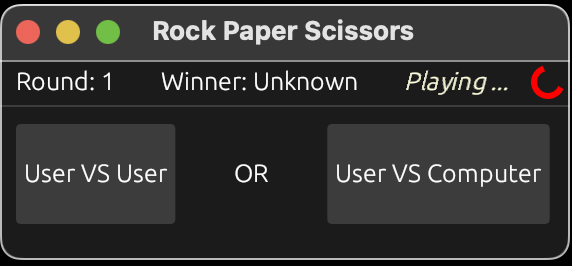
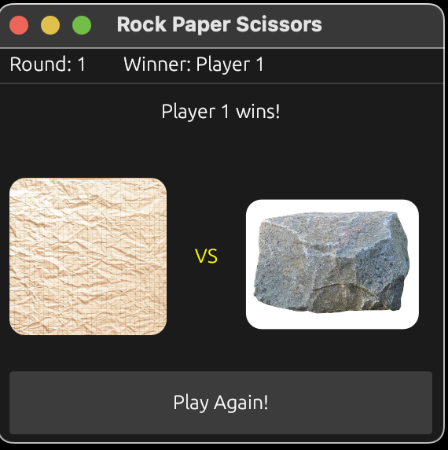

# Rock-Paper-Scissors Rust

This is a Rust UI application to play Rock-Paper-Scissors on the desktop.

## Function, Technologies and Challenges

The program opens a new window, and that very fast thanks to Rust :smile:, and provides the playing field and dashboard for the status of the game.

To develop a good, reliable solution for the user interface I found [egui](https://docs.rs/egui/latest/egui/) an incredible GUI framework written in Rust. Furthermore I included [eframe](https://docs.rs/eframe/latest/eframe/), thats an egui framework crate. And last but not least I added the [rand](https://docs.rs/rand/latest/rand/) for generating random numbers.

As I said earlier, egui is a great framework for UI components and applications but Rust combined with a new framework took some time to get used to it.

## How do I get it?

The *first* step ever when you want to start with a repository from GitHub, you clone it!
    - So head to the folder where you want to have your copied repository situated and then use this command in an opened command in your chosen destination: 
```
    git clone https://github.com/M4tt1-Coder/RockPaperScissors_Rust.git
```

- There some other options to clone it. For that please check it on GitHub in my repository!

Now if you have Rust already installed you start immediately, if not than go [here](https://www.rust-lang.org/tools/install),  install it and come 
back afterwards.

To check if Rust is already installed enter this command in the command line:
```
    cargo version
```
It should popup an information about the version of Rust and cargo the tool for it!
For me it looks like this:
```
    cargo 1.73.0
```

To run the game write this command in the terminal: 
```
    cargo run 
```

## And now what ... ?

I think you know how to play Rock-Paper-Scissors but just to make sure before you play, you can check the rules [here](https://www.wikihow.com/Play-Rock,-Paper,-Scissors).

Now after you ran ... :
```
    cargo run
```
... you should see something like this: 



Another page looks like this:



### First own custumization
Now you want to create your own game or app based on the existing repository?
Then take this few hints:
- Set your applications name:
```rust
    let app_name = "Your app name";
    //...
    //pass it in the running endpoint
    eframe::run_native(
        app_name,
        //...
    )
    
```
- When you want to create a component use an own function for it!
    - ... call it where you set your implementation of the App trait of egui
    ```rust
        fn display_your_content(ui: &mut Ui, app: &mut App){
            ui.horizontal(|ui| {
                    // do something
                }
            )
        }

        //then in the update function
        fn update(&mut self, ctx: &eframe::egui::Context, frame: &mut eframe::Frame) {
            display_your_content(ui, app);
        }
    ```

- Work with properties of the app struct you implemented to handle logic in the program:
```rust
    //if you look in my code there are more examples
    //...
    struct MyApp{
        user: Vec<User>,
        id: i8,
        //...
    }
```
So now that you know some little starts to build yourself the app you want based on the repository!

## Credits

First I have to say I build that simple game alone as a side project so it's free for every via license!
An idea for this project came from @hoss-green, thanks for the support my man!

The best help was the documentation of egui and eframe on github and the rust website for public crates.

- Click [here](https://docs.rs/egui/latest/egui/) to go to the egui-documentation.
- Checkout [this](https://github.com/emilk/egui/blob/c69fe941afdea5ef6f3f84ed063554500b6262e8/eframe/examples/image.rs) link to come to a example repository for the image usage with egui.
- You find eframe under [that](https://docs.rs/eframe/latest/eframe/) url.

My personal socials:
- [LinkedIn](https://www.linkedin.com/in/matthis-gei%C3%9Fler-4198b9258?utm_source=share&utm_campaign=share_via&utm_content=profile&utm_medium=android_app)
- [Fiverr](https://www.fiverr.com/matthisgeissler)
- [Instagram](https://instagram.com/_m4tt1.g31ssler_?igshid=ZTE5YWJnN29mMnA0)

## License

MIT License

Copyright (c) 2023 Matti

Permission is hereby granted, free of charge, to any person obtaining a copy
of this software and associated documentation files (the "Software"), to deal
in the Software without restriction, including without limitation the rights
to use, copy, modify, merge, publish, distribute, sublicense, and/or sell
copies of the Software, and to permit persons to whom the Software is
furnished to do so, subject to the following conditions:

The above copyright notice and this permission notice shall be included in all
copies or substantial portions of the Software.

THE SOFTWARE IS PROVIDED "AS IS", WITHOUT WARRANTY OF ANY KIND, EXPRESS OR
IMPLIED, INCLUDING BUT NOT LIMITED TO THE WARRANTIES OF MERCHANTABILITY,
FITNESS FOR A PARTICULAR PURPOSE AND NONINFRINGEMENT. IN NO EVENT SHALL THE
AUTHORS OR COPYRIGHT HOLDERS BE LIABLE FOR ANY CLAIM, DAMAGES OR OTHER
LIABILITY, WHETHER IN AN ACTION OF CONTRACT, TORT OR OTHERWISE, ARISING FROM,
OUT OF OR IN CONNECTION WITH THE SOFTWARE OR THE USE OR OTHER DEALINGS IN THE
SOFTWARE.
